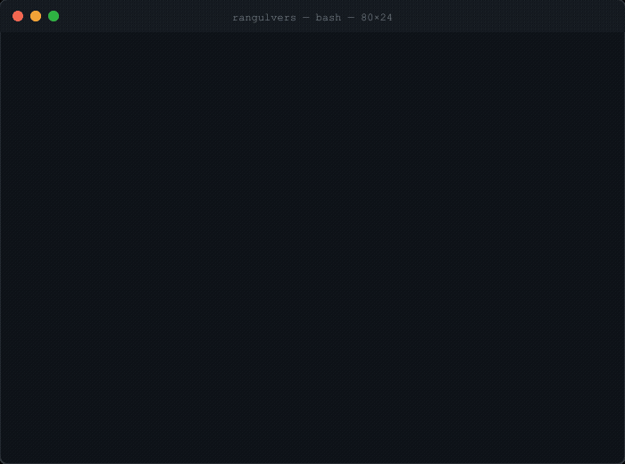

  

---

### whoami

Builder of things that probably don't need building — based in Germany. I run a Raspberry Pi AI hub that handles calendar lookups, voice transcription, and multi-project dev tasks via Telegram. I shipped a German municipal transparency portal (scraper → FastAPI → React → Railway) and tinker with video projection mapping, home automation, and whatever side project has captured my attention this week.

---

### stack

---

### stats

  
  

---

  always happy to chat about AI agents, home automation, civic tech, or why my Telegram bot keeps stealing its own polling slot

